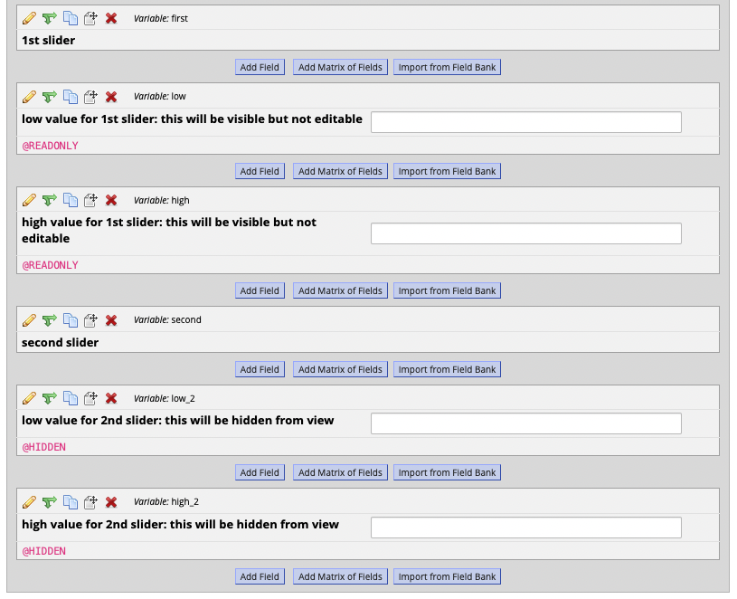
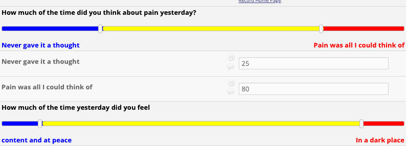
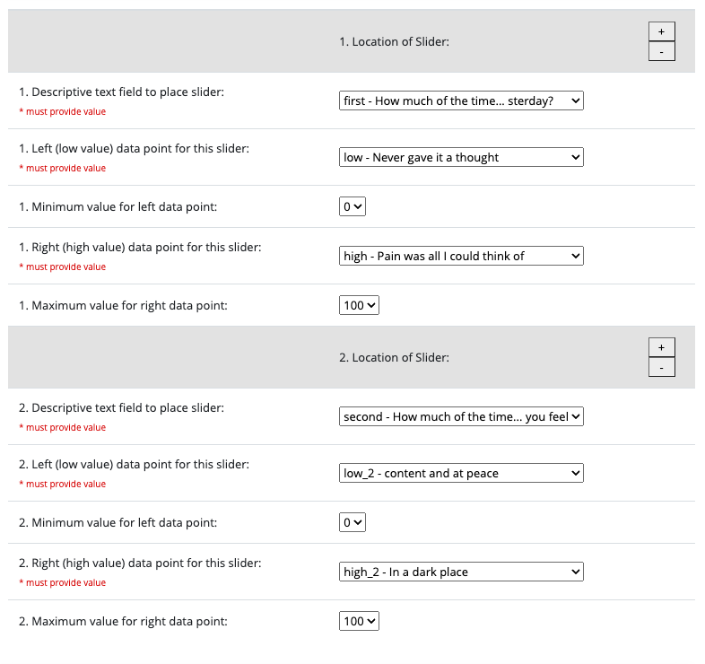

# Bootstrap Slider

## Introduction

This REDCap external module provides a packaged way to render [`bootstrap-slider`](https://github.com/seiyria/bootstrap-slider) within REDCap data entry forms and surveys.

The current version only renders [the third slider from Example 12](https://seiyria.com/bootstrap-slider/#example-12), with hardcoded colors and slider sizes.

Colors on the slider are in this order: blue, yellow, and red.

Users have the option to select minimum and maximum values from a dropdown. The default minimum value is 0, and the default maximum value is 100. The slider can store two values, ranging between the selected minimum and maximum.

## How to use

In order to render a slider, a data entry form or survey must have three fields:
1. a descriptive text field, for the slider to be rendered
2. a text field, to store the low value
3. another text field, to store the high value

**The text fields must use the @HIDDEN action tag, or they will appear on the data entry form/survey and be editable. Alternatively, if you want the values to be visible but not editable, you can use the @READONLY action tag for the text fields.**

**The labels from the text fields will be used as the selection text for the slider, appearing underneath the slider in their respective colors. Make sure to use the labels that you want appearing as options on the slider.**

The module currently does not have the ability to show the value selected directly on the slider.

Once these fields exists, they must be selected within the external module project configuration page for the sliders to be rendered.

Here is what a configuration should look like:
1. Location of Slider
  1. Descriptive text field to place slider: field 1 from above
  1. Left (low value) data point for this slider: field 2 from above
  1. Minimum value for left data point: default will be 0, but other options available
  1. Right (high value) data point for this slider: field 3 from above
  1. Maximum value for right data point: default will be 100, but other options available

## Changelog

**2022/07/27**: implements changes in color order, configurable minimum & maximum values, now extracts slider labels from configured text field

**2022/07/12**: 1st working version
